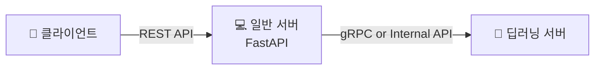

# 📝 백엔드 기초 개념 및 프로젝트 아키텍처 제안

## 1. API와 REST API의 이해

백엔드 서버의 역할을 이해하기 쉽게 **'식당'**에 비유해 보겠습니다.

### API 서버란?
API 서버는 클라이언트의 요청을 정해진 인터페이스 규칙에 따라 받아 처리하고, 그 결과를 반환하는 서버입니다. 식당으로 치면 손님의 주문을 받고, 주방과 연결해 결과를 내어주는 **'점원'**에 가깝습니다.

### REST API란?
REST는 웹을 위한 아키텍처 스타일입니다. 실무에서는 보통 HTTP 메서드와 URI를 이용해 자원(Resource)을 조회·생성·수정·삭제하는 형태로 구현합니다. 즉, REST API는 클라이언트와 서버가 **자원을 중심으로 통신**하도록 정리한 방식이라고 볼 수 있습니다. 

**예시**
예를 들어 특정 사용자의 정보를 조회할 때는 다음과 같이 표현할 수 있습니다.
> `GET /users/{user_id}`

이처럼 클라이언트는 무엇을 원하는지를 URI와 HTTP 메서드로 표현하고, 서버는 그 요청을 처리해 JSON 등의 형태로 응답합니다.

---

## 2. 개발 프레임워크 비교와 FastAPI 추천

이번 프로젝트는 단순 웹페이지가 아니라, 모바일/태블릿 클라이언트가 필기 이미지를 업로드하고, 서버가 이를 받아 AI 분석을 수행한 뒤 결과 리포트를 반환하는 구조를 가정하고 있습니다. 따라서 프레임워크 비교도 단순 인기보다 다음 기준으로 보는 것이 더 적절합니다.

* Python 기반 AI 처리와의 연계성
* API 문서화와 요청/응답 검증 편의성
* 팀 학습 난이도와 개발 생산성
* 구조적 확장성, 성능과 유지보수성

### 📊 주요 프레임워크 비교

| 프레임워크 | 주 언어 | 공식적으로 드러나는 성격 | 프로젝트 관점 평가 |
| :--- | :--- | :--- | :--- |
| **FastAPI** | Python | Python 타입 힌트 기반 API 프레임워크 (OpenAPI, 비동기 지원) | **[가장 추천]** AI 코드와 같은 Python 생태계로 묶기 좋고, 문서화·검증·API 개발 속도의 균형이 좋음. |
| **Flask** | Python | 경량 WSGI 웹 프레임워크 | 가볍고 배우기 쉽지만, 인증·검증·문서화 등을 직접 더 많이 구성해야 해서 팀 프로젝트에서는 설정 부담이 커질 수 있음. |
| **Django** | Python | “batteries-included” 철학의 프레임워크 | 기능이 강력하지만, 이번처럼 API 중심 + AI 연동 구조에는 다소 무겁게 느껴질 수 있음. |
| **Express** | JS / Node.js | 빠르고 최소주의적인 Node.js 웹 프레임워크 | 자유도는 높지만, AI 분석 서버를 Python으로 둘 경우 언어가 분리되어 전체 구조가 이원화될 가능성이 큼. |
| **NestJS** | TS / Node.js | 구조화된 확장 가능 Node.js 프레임워크 | 대규모 팀 개발에는 강하지만, Python AI 스택과 바로 맞물리는 점에서는 FastAPI보다 불리함. |
| **Gin** | Go | 고성능 Go HTTP 웹 프레임워크 | 성능은 우수하지만, 팀이 Go에 익숙하지 않다면 학습 비용이 생기고 AI 서버와의 언어 일관성도 떨어짐. |

### ✅ 왜 FastAPI를 가장 추천하는가

1. **AI/딥러닝 서버와 언어 생태계를 통일하기 쉽습니다.**
   필체 분석, 이미지 전처리, 추론 로직은 Python 생태계에서 구현하는 경우가 많습니다. FastAPI도 Python 기반이므로, 백엔드 API 계층과 AI 처리 계층을 같은 언어 계열로 맞추기 쉽습니다. 
2. **자동 문서화가 강력합니다.**
   FastAPI는 OpenAPI 기반 자동 문서화와 기본 내장 문서 UI를 제공합니다. 즉, 프론트엔드·백엔드 협업에서 API 명세 관리가 상대적으로 쉬워집니다. 
3. **요청/응답 검증이 편리합니다.**
   FastAPI는 타입 선언과 모델 기반으로 요청/응답 구조를 문서화하고 검증하는 흐름이 잘 갖춰져 있습니다. 입력 형식이 분명한 분석 API에 적합합니다. 
4. **비동기 처리에 자연스럽게 대응할 수 있습니다.**
   이미지 업로드, 결과 대기, 내부 분석 서버 호출처럼 I/O 대기가 있는 구조에서 `async/await` 지원은 실용적입니다. 
5. **Flask보다 체계적이고, Django보다 가볍습니다.**
   API 중심 프로젝트에 특화된 가장 적절한 균형점을 제공합니다.

---

## 3. 필체 교정 앱을 위한 백엔드 구조 제안

이 프로젝트는 `이미지 업로드 → 필체 분석 → 오차율 계산 → 결과 리포트 생성 및 반환`의 흐름을 가집니다. 따라서 일반 서비스 서버와 딥러닝 처리 서버를 분리하는 편이 더 적절합니다.

### 🏗️ 제안하는 서버 아키텍처

* **클라이언트:** 사용자가 모바일 또는 태블릿에서 필체를 입력하거나 이미지를 업로드하고, 결과를 조회합니다.
* **일반 서버 (FastAPI):** 인증, 사용자 관리, 요청 수신, 파일 저장, 결과 반환 등 서비스 로직 전반을 담당하는 주 백엔드 서버입니다.
* **딥러닝 서버:** 필체 이미지 전처리, 획 정보 추출, 오차율 계산 및 분석 결과를 생성합니다. 

> 💡 **분리 이점:** 이렇게 분리하면 일반 웹 기능과 AI 추론 기능을 나눌 수 있어 유지보수와 확장성이 좋아집니다. 추후 모델 교체나 성능 개선이 필요할 때도 딥러닝 서버를 별도로 조정하기 쉽습니다.

---

## 4. 통신 방식 비교 (REST API, gRPC, WebSocket, MQTT)

프로젝트의 통신 방식은 하나만 고르는 문제가 아니라, 어느 계층에서 어떤 문제를 해결할 것인가로 나누어 보아야 합니다.

### 📊 통신 방식 비교

| 방식 | 통신 모델 | 공식적 특징 | 이 프로젝트에서의 적합성 |
| :--- | :--- | :--- | :--- |
| **REST API** | 요청-응답 | 자원 중심, 웹 아키텍처 스타일, HTTP 기반 | **매우 높음** (모바일 앱의 기본 통신) |
| **gRPC** | RPC (스트리밍) | `.proto` 기반, HTTP/2 지원, 서버 간 통신 특화 | **서버 간 통신에 매우 높음** (일반 ↔ 딥러닝 서버) |
| **WebSocket** | 양방향 연결 | 브라우저-서버 사이의 실시간 상호작용 세션 | **실시간 기능이 있을 때 높음** (진행률 표시 등) |
| **MQTT** | Pub/Sub | 경량 메시징, 제약 장치·저대역폭 환경에 적합 | **IoT 확장 시 높음** (스마트펜 연동 등) |

### ✅ 이 프로젝트에서의 최종 추천

현재 단계의 가장 현실적인 선택은 다음과 같습니다.

1. **클라이언트 ↔ 일반 서버:** REST API (회원가입, 이미지 업로드, 리포트 조회 등)
2. **일반 서버 ↔ 딥러닝 서버:** gRPC 또는 내부 API (이미지 분석, 획 정보 추출 등 명확한 내부 계약)
3. **실시간 진행률/상태 알림 필요 시:** WebSocket 추가
4. **향후 스마트펜·IoT 장치 연동 시:** MQTT 검토

---

## 🎯 최종 결론

이번 필체 교정 앱 프로젝트에서는 다음 구조를 가장 추천합니다.

* **백엔드 프레임워크:** FastAPI
* **클라이언트와의 기본 통신:** REST API
* **딥러닝 서버와의 내부 통신:** gRPC
* **실시간 기능 확장:** 필요시 WebSocket 도입
* **IoT 장치 확장:** 필요시 MQTT 검토

> *"클라이언트에는 FastAPI 기반 REST API를 제공하고, 내부 AI 분석 계층은 gRPC로 분리하며, 실시간성과 IoT는 필요 시 WebSocket과 MQTT로 확장한다."*
