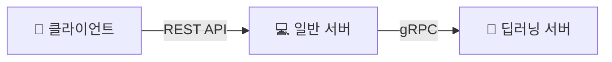

# 📝 백엔드 기초 개념 및 프로젝트 아키텍처 제안

## 1. API와 REST API의 이해

백엔드 서버의 역할을 이해하기 쉽게 '식당'에 비유해 보겠습니다.

* **API 서버란?**
  [span_0](start_span)API 서버는 간단하게 말하면, 클라이언트의 요청(정확하게는 API 형태에 맞춘 요청)을 처리하여 반환하는 역할을 합니다[span_0](end_span). 식당으로 치면 손님(클라이언트)의 주문을 받고 요리를 내어주는 **'점원'**과 같습니다.
* **REST API란?**
  REST API는 이 점원과 소통하기 위해 널리 사용되는 '표준 통신 규약'입니다. 식당에서 주문할 때 사용하는 **'메뉴판과 주문 규칙'**이라고 생각하면 쉽습니다.
  * **[span_1](start_span)동작 규칙:** GET, POST, PUT/PATCH, DELETE라는 4가지 행동(HTTP 메서드)을 사용하여 요청의 목적을 4가지로 분류합니다[span_1](end_span).
  * **[span_2](start_span)예시:** 무언가 정보를 얻고자 할 때는 GET을 사용하며[span_2](end_span)[span_3](start_span), 특정 유저의 정보를 얻기 위해 `https://mywebsite/user/{user_id}/` 와 같은 경로로 요청을 보냅니다[span_3](end_span). [span_4](start_span)(사용자 정보를 수정하는 것도 가능은 하지만 권장하지는 않습니다[span_4](end_span)).

## 2. 개발 프레임워크와 FastAPI

서버를 쉽게 만들 수 있도록 미리 만들어진 뼈대를 웹 프레임워크라고 합니다. [span_5](start_span)백엔드를 지원하는 프레임워크로는 flask, node.js, next.js, Go, Django, nestjs 등 정말 다양하게 존재합니다[span_5](end_span).

[span_6](start_span)하지만 우리 회의 내용 중에 가장 많이 언급되었던 **FastAPI**가 우리 프로젝트에 가장 적합합니다[span_6](end_span). 그 이유는 다음과 같은 3가지 특징 때문입니다.

1. **[span_7](start_span)파이썬 기반 프레임워크:** 파이썬 언어를 기반으로 사용할 수 있어[span_7](end_span)[span_8](start_span), 딥러닝이 돌아갈 환경을 고려할 때 가장 적합한 선택입니다[span_8](end_span).
2. **[span_9](start_span)RESTful API 지원:** 프레임워크가 REST API를 온전히 지원합니다[span_9](end_span).
3. **[span_10](start_span)비동기적 처리 지원:** 어떤 요청에 대하여 응답이 올 때까지 기다리는 동기 방식이 아니라, 비동기 처리를 기본적으로 지원하여 효율적입니다[span_10](end_span).

## 3. 필체 교정 앱을 위한 백엔드 구조 제안

[span_11](start_span)단순히 클라이언트와 서버 간의 통신이 목적이라면 REST API가 가장 쉽고 문서화가 간단합니다[span_11](end_span). [span_12](start_span)하지만 JSON 기반 통신이므로 이미지를 전송하거나 실시간 통신을 하는 데에는 단점이 존재합니다[span_12](end_span). 
[span_13](start_span)우리의 프로젝트 구조를 생각하면 필체 이미지를 빠르고 안정적으로 처리하기 위해 다음과 같은 분리형 서버 구조가 가장 적합하리라 생각합니다[span_13](end_span).

### 🏗️ 제안하는 서버 아키텍처

* **[span_14](start_span)일반 서버:** 사용자 계정 정보 등의 저장을 담당합니다[span_14](end_span).
* **[span_15](start_span)딥러닝 서버:** 무거운 이미지 연산과 필체 교정 분석을 전담합니다[span_15](end_span).
* **[span_16](start_span)gRPC의 활용:** 내부 서버 간 통신에는 MQTT, 웹소캣, GraphQL 등 다양한 통신 방법이 존재하지만[span_16](end_span)[span_17](start_span), 바이너리 데이터를 주고받기 때문에 속도가 빠르다는 장점이 있는 gRPC를 사용합니다[span_17](end_span).

